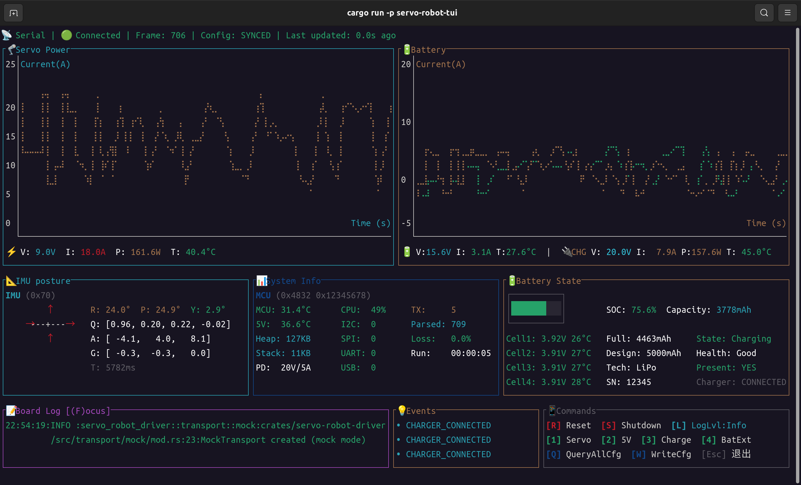

# servo-robot-tui

[English](README_en.md) | 简体中文

基于 ratatui 的 STM32 机器人监控 TUI 界面，用于实时显示传感器数据、系统状态和控制命令。



## 特性

- 实时折线图显示舵机电流/功率和电池电流/充电功率
- IMU 姿态可视化（四元数、加速度、陀螺仪）
- 电池状态监控（SOC、电芯电压温度、充放电功率）
- STM32 系统信息（温度、错误计数、丢包率、运行时间）
- 事件状态栏（充电、风扇、保护标志、错误标志）
- 交互式命令栏（配置查询/编辑）
- 板级日志查看器
- 支持 Driver 直接调用或 ROS2 数据源

## 快速开始

```bash
# 使用 MockTransport 运行（无需硬件）
cargo run -p servo-robot-tui

# 启用 mock feature
cargo run -p servo-robot-tui --features mock

# 设置日志等级
RUST_LOG=info cargo run -p servo-robot-tui
```

## 快捷键

| 按键 | 功能 | 说明 |
|------|------|------|
| R | 复位设备 | 红色（破坏性操作） |
| S | 关机 | 红色（破坏性操作） |
| 1 | 切换舵机电源 | 绿色=开 / 红色=关 |
| 2 | 切换 5V 电源 | 绿色=开 / 红色=关 |
| 3 | 切换充电 | 绿色=开 / 红色=关 |
| 4 | 切换电池额外输出 | 绿色=开 / 红色=关 |
| Q | 查询所有配置 | 蓝色 |
| W | 打开配置编辑器 | 蓝色 |
| L | 循环切换日志等级 | - |
| F | 日志聚焦模式 | - |
| Esc | 退出/关闭弹窗 | - |

### 数据流

```
Driver/ROS2 → DataSource → App.update() → UI.render()
                ↓
           DataSnapshot (线程安全快照)
                ↓
           ChartData (VecDeque 环形缓冲区)
```

### 关键设计

1. **数据源抽象**：`DataSource` trait 支持 Driver 和 ROS2 两种数据源
2. **状态快照**：`DataSnapshot` 包含所有传感器数据的最新值
3. **折线图数据**：`ChartData` 使用 `VecDeque` 存储最近 N 个数据点
4. **颜色阈值**：根据配置中的电流/温度限制动态调整显示颜色
5. **命令模式**：支持确认对话框、配置查询、配置编辑三种模式

## 依赖

- `ratatui` - TUI 框架
- `crossterm` - 终端控制
- `servo-robot-driver` - 驱动库

## License

GPL-3.0
